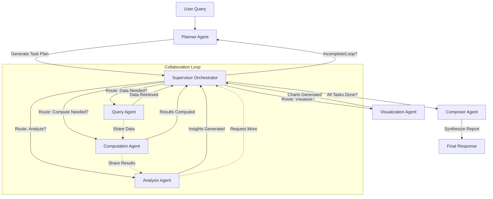

### Multi-Agent System Design for Business Intelligence

Based on your setup with LangGraph and LangChain, I'll propose an optimized, collaborative multi-agent system for Business Intelligence (BI). This design emphasizes modularity, scalability, and collaboration among agents to handle complex queries involving data retrieval, analysis, computation, and synthesis. It builds on your existing components (Query Agent, Computation Agent, Planner, and Composer) while enhancing them and adding necessary agents for robustness.

The system uses a **hierarchical collaborative architecture** inspired by LangGraph's graph-based workflows:
- **Supervisor-Orchestrator Pattern**: A central Supervisor node routes tasks dynamically based on the query's needs, allowing agents to collaborate by sharing state (e.g., via LangGraph's graph state).
- **Collaboration Mechanism**: Agents communicate through a shared memory (e.g., LangGraph's StateGraph with persistent state). This enables iterative refinement—e.g., the Analysis Agent can request more data from the Query Agent if needed.
- **Tools Integration**: Each agent uses LangChain tools (e.g., SQL queries, Python REPL for computations, APIs for external data).
- **Error Handling and Retry**: Built-in retries for failed agents (e.g., your non-working Computation Agent can be wrapped with retries).
- **Scalability**: Agents can be parallelized where possible (e.g., querying multiple data sources simultaneously).
- **Why Collaborative?**: Agents don't work in isolation; they can "consult" each other via the Supervisor, which decides on loops or escalations. For example, if analysis reveals anomalies, it loops back to the Planner for sub-tasks.

#### Key Agents and Their Roles
Here's the refined set of agents, building on yours:

1. **Planner Agent** (Enhanced from yours):
   - Role: Decomposes the user query into a plan of sub-tasks (e.g., "Fetch sales data" → "Analyze trends" → "Compute forecasts").
   - Tools: LangChain's LLMChain for natural language planning; can use structured output (e.g., JSON schemas for tasks).
   - Collaboration: Outputs a task list that the Supervisor uses to route to other agents.

2. **Query Agent** (Your existing one):
   - Role: Retrieves data from sources like databases (SQL/NoSQL), APIs (e.g., Google Analytics, CRM), or files (CSV/Excel).
   - Tools: LangChain's SQLDatabaseToolkit or API chains.
   - Collaboration: Can be called multiple times if other agents need more data; shares retrieved data in graph state.

3. **Computation Agent** (Fixed/Enhanced from yours):
   - Role: Performs numerical computations, stats, or ML tasks (e.g., calculating KPIs, running regressions).
   - Tools: Python REPL tool via LangChain (for safe execution); integrate libraries like NumPy, SciPy, or scikit-learn.
   - Fix Suggestion: If it's not working, ensure it's using LangChain's ToolExecutor with error handling. Wrap in a try-except block in the agent's code and add logging.
   - Collaboration: Receives data from Query Agent; can request clarifications via Supervisor.

4. **Analysis Agent** (New Addition):
   - Role: Interprets data, identifies insights (e.g., trends, anomalies, correlations), and generates reports.
   - Tools: LangChain's LLM for reasoning; integrate with Pandas for data manipulation.
   - Collaboration: Works on outputs from Query/Computation; can loop back to Computation for deeper calcs.

5. **Visualization Agent** (New Addition, Optional but Recommended for BI):
   - Role: Generates charts/graphs (e.g., bar charts for sales trends) using libraries like Matplotlib or Plotly, exported as images or embeds.
   - Tools: Python-based rendering tools.
   - Collaboration: Triggered if the plan includes visuals; shares outputs with Composer.

6. **Composer Agent** (Enhanced from yours, under Orchestration):
   - Role: Synthesizes results from all agents into a cohesive response (e.g., a BI report with insights, data, and visuals).
   - Tools: LLM for summarization and formatting (e.g., Markdown or JSON output).
   - Collaboration: Accesses full graph state; can request revisions from Supervisor if incomplete.

7. **Supervisor Node** (New, Central Orchestrator):
   - Role: Routes tasks based on Planner's output; decides sequence, parallelism, or loops (e.g., "If analysis incomplete, re-query").
   - Implementation: Use LangGraph's ConditionalEdge for dynamic routing.
   - Collaboration: Enables all inter-agent interactions; monitors state for convergence.

#### Implementation Guidelines in LangGraph/LangChain
- **Graph Structure**: Use LangGraph's StateGraph. Define a custom State schema (e.g., TypedDict with fields like `query`, `plan`, `data`, `insights`, `final_report`).
- **Entry Point**: User query → Planner → Supervisor routes to agents.
- **Parallelism**: Use LangGraph's parallel nodes for non-dependent tasks (e.g., Query multiple datasets at once).
- **Persistence**: Use LangGraph's memory (e.g., CheckpointMemory) for state across sessions.
- **LLM Backbone**: Use a strong model like GPT-4 or Grok via LangChain's ChatOpenAI or similar.
- **Testing/Fixing Computation Agent**: Start with simple tests: Pass sample data and compute sums/averages. Add validation to inputs.
- **Best Practices**:
  - Agents as Nodes: Each agent is a function/node in the graph.
  - Edges: Conditional based on state (e.g., if `data` is None, edge to Query Agent).
  - Error Recovery: Use LangChain's retry_parser for failed tool calls.
  - Output: Composer formats as JSON for API use or Markdown for human-readable BI reports.

This design is "best" because it's flexible (handles simple queries linearly, complex ones collaboratively), efficient (minimizes redundant calls), and extensible (add agents like a Forecasting Agent later).

### Workflow Design
Below is a Mermaid flowchart representing the high-level workflow. It shows the graph-like structure with nodes (agents) and edges (flows/decisions). Copy-paste this into a Mermaid renderer (e.g., mermaid.live) to visualize.

- **Explanation**: The flow starts with planning, then dynamic routing by the Supervisor. Arrows show sequential/conditional paths; dotted lines indicate collaborative data sharing. Loops allow iteration (e.g., if analysis needs more computation). For parallelism, imagine branches from Supervisor to multiple agents simultaneously.