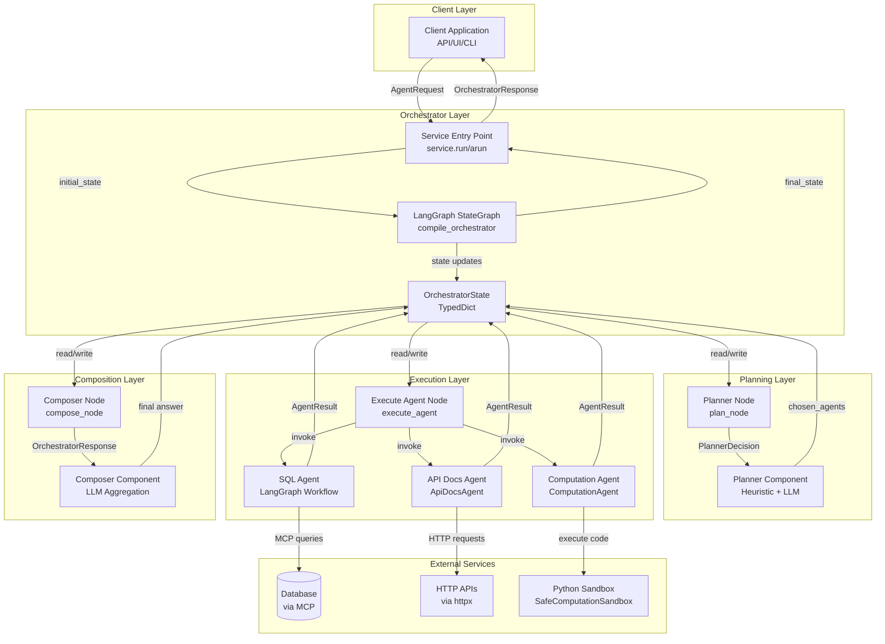
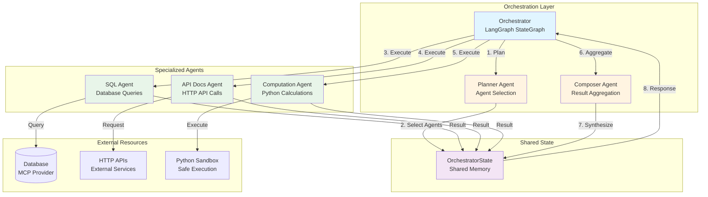
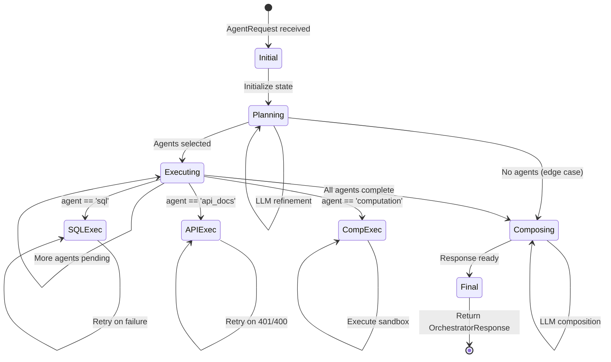
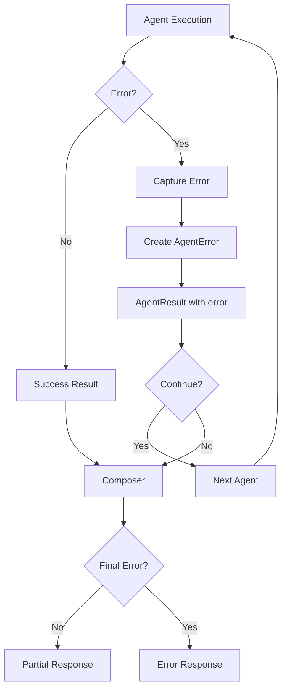
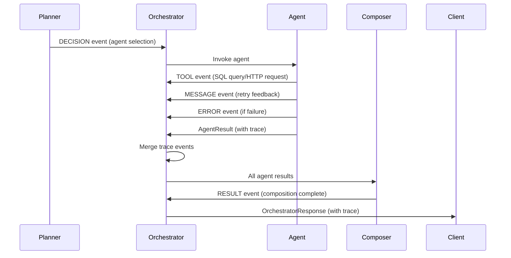

# Bos-AI Multi-Agent System: Data Flow & Architecture

## Table of Contents
1. [System Architecture Overview](#system-architecture-overview)
2. [Multi-Agent Architecture](#multi-agent-architecture)
3. [Component Communication Patterns](#component-communication-patterns)
4. [Data Structures & Message Formats](#data-structures--message-formats)
5. [State Management & Flow](#state-management--flow)
6. [Inter-Component Communication Protocols](#inter-component-communication-protocols)
7. [Data Transformation Pipeline](#data-transformation-pipeline)
8. [Error Propagation & Handling](#error-propagation--handling)
9. [Trace & Observability](#trace--observability)
10. [Low-Level Design](#low-level-design)

---

## System Architecture Overview

### High-Level Architecture



### Component Responsibilities

| Component | Responsibility | Communication Pattern |
|-----------|--------------|----------------------|
| **Service Entry** | Graph compilation, request/response handling | Synchronous/Async invocation |
| **StateGraph** | Workflow orchestration, state transitions | State-based routing |
| **Planner** | Agent selection, execution ordering | Request → Decision |
| **SQL Agent** | Database query generation & execution | State → Query → Result |
| **API Docs Agent** | HTTP API planning & execution | Question → Plan → HTTP → Summary |
| **Computation Agent** | Safe Python code execution | Question → Plan → Sandbox → Result |
| **Composer** | Result aggregation & final answer | Results → LLM → Response |

---

## Multi-Agent Architecture

### Architecture Pattern: Hierarchical Orchestration

The Bos-AI system implements a **hierarchical orchestration pattern** with a central orchestrator coordinating specialized agents. This pattern provides:

- **Centralized Control**: Single orchestrator manages agent execution order
- **Specialized Agents**: Each agent has domain-specific capabilities
- **State-Based Collaboration**: Agents share information through shared state
- **Sequential Execution**: Agents execute one-by-one, accumulating results
- **Result Aggregation**: Composer synthesizes all agent outputs

### Multi-Agent System Diagram



### Agent Roles & Responsibilities

#### 1. Planner Agent (Meta-Agent)

**Role**: Meta-agent responsible for agent selection and execution planning

**Responsibilities**:
- Analyze user question to determine required capabilities
- Select appropriate agents based on keyword matching and LLM reasoning
- Order agents for optimal execution sequence
- Apply user preferences and constraints
- Provide rationale for agent selection

**Capabilities**:
- Heuristic keyword matching (SQL, API, computation keywords)
- LLM-based reasoning for complex queries
- Preference handling (prefer/disable agents)
- Confidence scoring (0.0-1.0)

**Input**: `AgentRequest` (question, context, preferences)
**Output**: `PlannerDecision` (chosen_agents, rationale, confidence)

**Collaboration**:
- **With Orchestrator**: Receives request, returns decision
- **With Agents**: Indirectly (through orchestrator's execution plan)

#### 2. SQL Agent (Data Retrieval Specialist)

**Role**: Specialized agent for database query generation and execution

**Responsibilities**:
- Generate SQL queries from natural language questions
- Execute read-only queries via MCP provider
- Validate query safety (forbidden keywords, table whitelist)
- Retry failed queries with error feedback
- Transform query results into structured tabular data

**Capabilities**:
- Natural language to SQL translation
- Schema awareness (table overview, column information)
- Query safety validation
- Automatic retry with error learning (up to 4 attempts)
- Result interpretation and summarization

**Input**: Question string, context dict
**Output**: `AgentResult` with `TabularResult` (columns, rows, row_count)

**Collaboration**:
- **With Database**: Via MCP tools (`mcp_db_query`, `mcp_db_schema`)
- **With Orchestrator**: Returns results to shared state
- **With Composer**: Provides tabular data for aggregation

**Internal Architecture**:
- LangGraph workflow with multiple nodes
- Message-based conversation with LLM
- Tool calling for MCP integration

#### 3. API Docs Agent (API Integration Specialist)

**Role**: Specialized agent for HTTP API planning and execution

**Responsibilities**:
- Select appropriate API endpoints from documentation
- Plan HTTP requests (method, path, params, headers)
- Execute HTTP requests with authentication
- Handle retries (401 token refresh, 400 param adjustment)
- Summarize API responses

**Capabilities**:
- Endpoint selection via token-based scoring
- HTTP request planning (LLM-based)
- Firebase authentication (token resolution, refresh)
- Automatic retry logic (401/400 handling)
- Response summarization

**Input**: Question string, context dict (with API config)
**Output**: `AgentResult` with natural language summary

**Collaboration**:
- **With External APIs**: Via httpx HTTP client
- **With Orchestrator**: Returns results to shared state
- **With Composer**: Provides API response summaries

**Internal Architecture**:
- Two-phase execution (planning → execution)
- Endpoint catalog from YAML documentation
- Token-based endpoint matching

#### 4. Computation Agent (Calculation Specialist)

**Role**: Specialized agent for safe Python code execution

**Responsibilities**:
- Generate computation plans from natural language
- Execute Python code in sandboxed environment
- Validate code safety (imports, system calls)
- Capture computation results (stdout, locals, return values)
- Summarize computation outputs

**Capabilities**:
- Natural language to Python code translation
- Sandboxed execution (restricted imports, system calls)
- Result capture (structured and unstructured)
- Error handling (sandbox violations)

**Input**: Question string, context dict
**Output**: `AgentResult` with computation results

**Collaboration**:
- **With Sandbox**: Executes code in isolated environment
- **With Orchestrator**: Returns results to shared state
- **With Composer**: Provides computation results for aggregation

**Internal Architecture**:
- LLM-based code generation
- SafeComputationSandbox for execution
- Result parsing and summarization

#### 5. Composer Agent (Synthesis Specialist)

**Role**: Meta-agent responsible for aggregating and synthesizing agent results

**Responsibilities**:
- Collect all agent results from shared state
- Select appropriate tabular data (first successful agent)
- Synthesize natural language answer from all results
- Format final response with metadata
- Handle partial results (some agents failed)

**Capabilities**:
- Multi-agent result aggregation
- LLM-based answer synthesis
- Tabular data selection
- Metadata annotation (confidence, agents)

**Input**: Question, planner rationale, list of `AgentResult`
**Output**: `OrchestratorResponse` (answer, data, metadata)

**Collaboration**:
- **With All Agents**: Reads results from shared state
- **With Planner**: Uses rationale for context
- **With Orchestrator**: Returns final response

**Internal Architecture**:
- LLM prompt engineering for synthesis
- Tabular data prioritization
- Metadata extraction

### Agent Collaboration Mechanisms

#### 1. Shared State Collaboration

**Pattern**: State-based information sharing

**Mechanism**:
- All agents read/write to `OrchestratorState`
- State persists across agent executions
- Agents accumulate results in `agent_results` list
- Composer reads all accumulated results

**Flow**:
```
Agent 1 → writes to state.agent_results[0]
Agent 2 → writes to state.agent_results[1]
Agent 3 → writes to state.agent_results[2]
Composer → reads state.agent_results (all)
```

**Benefits**:
- Agents don't need direct communication
- Orchestrator manages coordination
- Results accumulate automatically
- Easy to add new agents

#### 2. Sequential Execution Pattern

**Pattern**: Agents execute one-by-one in planned order

**Mechanism**:
- Planner determines execution order
- Orchestrator executes agents sequentially
- Each agent completes before next starts
- Results accumulated in order

**Flow**:
```
Planner → [agent1, agent2, agent3]
Orchestrator → execute agent1 → wait → execute agent2 → wait → execute agent3
```

**Benefits**:
- Simple coordination (no race conditions)
- Predictable execution order
- Easy debugging (linear execution)
- Results available in order

**Limitations**:
- No parallel execution (slower for independent agents)
- Agents can't request additional data from other agents
- No iterative refinement between agents

#### 3. Context Sharing Pattern

**Pattern**: Request context shared with all agents

**Mechanism**:
- `AgentRequest.context` passed to all agents
- Temporal context auto-injected
- API configuration shared
- Authentication tokens shared

**Flow**:
```
Request → Temporal Context Injection → All Agents Receive Context
```

**Benefits**:
- Consistent configuration across agents
- Temporal context available to all
- API credentials shared
- No redundant context passing

#### 4. Result Accumulation Pattern

**Pattern**: Agent results accumulated in shared list

**Mechanism**:
- Each agent execution appends `AgentResult` to list
- Composer reads entire list
- Results include success and failure
- Trace events merged chronologically

**Flow**:
```
agent_results = []
execute_agent(sql) → agent_results.append(sql_result)
execute_agent(api) → agent_results.append(api_result)
execute_agent(comp) → agent_results.append(comp_result)
compose(agent_results) → final_answer
```

**Benefits**:
- All results available to composer
- Failed agents still contribute (error context)
- Transparency (all results visible)
- Easy debugging (full execution history)

### Agent Coordination Patterns

#### Pattern 1: Planner-Driven Coordination

**Description**: Planner determines agent execution order upfront

**Flow**:
```
User Question → Planner → Agent List → Sequential Execution → Composer
```

**Characteristics**:
- **Static Planning**: Order determined before execution
- **No Dynamic Routing**: Order doesn't change during execution
- **Predictable**: Same question → same agent order
- **Simple**: No complex coordination logic

**Use Cases**:
- Simple queries requiring single agent
- Queries with clear agent requirements
- Queries where order doesn't matter

#### Pattern 2: Sequential Accumulation

**Description**: Agents execute sequentially, results accumulate

**Flow**:
```
Agent 1 → Result 1 → Agent 2 → Result 2 → Agent 3 → Result 3 → Composer
```

**Characteristics**:
- **Sequential**: One agent at a time
- **Accumulative**: Results build up
- **Independent**: Agents don't depend on each other's results
- **Linear**: Simple execution path

**Use Cases**:
- Multi-faceted queries (e.g., "List APIs and query database")
- Queries requiring multiple data sources
- Queries where agents complement each other

#### Pattern 3: Composer-Based Synthesis

**Description**: Composer aggregates all agent results into final answer

**Flow**:
```
[Agent Results] → Composer → LLM Synthesis → Final Answer
```

**Characteristics**:
- **Aggregative**: All results considered together
- **Synthetic**: LLM generates coherent answer
- **Selective**: Composer selects best tabular data
- **Contextual**: Uses planner rationale for context

**Use Cases**:
- Complex queries requiring multiple agents
- Queries needing result synthesis
- Queries with conflicting or complementary results

### Agent Interaction Scenarios

#### Scenario 1: Single Agent Execution

**Query**: "List all tables in the database"

**Flow**:
```
Planner → [sql] → SQL Agent → Result → Composer → Response
```

**Characteristics**:
- Single agent selected
- Direct execution
- Simple aggregation

#### Scenario 2: Multi-Agent Complementary Execution

**Query**: "List me all the API points available to you"

**Flow**:
```
Planner → [api_docs, sql] → 
  API Docs Agent → Result 1 →
  SQL Agent → Result 2 →
  Composer → Synthesized Response
```

**Characteristics**:
- Multiple agents selected
- Complementary results
- Composer synthesizes

#### Scenario 3: Agent Failure Handling

**Query**: "Query database and call API"

**Flow**:
```
Planner → [sql, api_docs] →
  SQL Agent → Success → Result 1 →
  API Docs Agent → Failure → Error Result →
  Composer → Partial Response (with error context)
```

**Characteristics**:
- Some agents succeed, some fail
- Failed agents still contribute (error context)
- Composer handles partial results
- Response includes all results (transparency)

### Agent Capability Matrix

| Agent | Data Retrieval | API Integration | Computation | Natural Language | Structured Output |
|-------|---------------|-----------------|-------------|------------------|-------------------|
| **SQL Agent** | ✅ (Database) | ❌ | ❌ | ✅ (Query Gen) | ✅ (TabularResult) |
| **API Docs Agent** | ❌ | ✅ (HTTP APIs) | ❌ | ✅ (Planning, Summary) | ❌ |
| **Computation Agent** | ❌ | ❌ | ✅ (Python) | ✅ (Code Gen) | ✅ (TabularResult) |
| **Planner** | ❌ | ❌ | ❌ | ✅ (Reasoning) | ✅ (PlannerDecision) |
| **Composer** | ❌ | ❌ | ❌ | ✅ (Synthesis) | ✅ (OrchestratorResponse) |

### Agent Execution Model

#### Current Model: Sequential Execution

**Architecture**:
```
Orchestrator maintains queue: [agent1, agent2, agent3]
For each agent in queue:
    Execute agent synchronously
    Append result to agent_results
    Continue to next agent
```

**Advantages**:
- Simple implementation
- No race conditions
- Predictable execution
- Easy debugging

**Disadvantages**:
- Slower for independent agents
- No parallel execution
- Agents can't request additional data

#### Future Model: Parallel Execution (Potential)

**Architecture**:
```
Orchestrator identifies independent agents: [agent1, agent2] (parallel)
Execute agent1 and agent2 concurrently
Wait for both to complete
Continue with agent3 (depends on agent1)
```

**Requirements**:
- Dependency analysis
- Parallel execution infrastructure
- Result synchronization
- Error handling for parallel failures

### Agent Communication Protocols

#### Protocol 1: Orchestrator → Agent

**Format**:
```python
AgentResult = agent.invoke(
    question: str,
    context: Dict[str, Any]
)
```

**Characteristics**:
- Synchronous invocation
- Context passed explicitly
- Result returned immediately
- Error captured in result

#### Protocol 2: Agent → External Service

**SQL Agent → Database**:
```python
# Via MCP tools
result = mcp_tool.invoke({
    "query": "SELECT ...",
    "database": "..."
})
```

**API Docs Agent → HTTP API**:
```python
# Via httpx
response = httpx.Client().request(
    method="GET",
    url="https://...",
    headers={...}
)
```

**Computation Agent → Sandbox**:
```python
# Via SafeComputationSandbox
result = sandbox.execute(code)
```

#### Protocol 3: Agent → Shared State

**Write Pattern**:
```python
# Agent returns result
result = AgentResult(...)

# Orchestrator appends to state
state["agent_results"].append(result)
state["trace"].extend(result.trace)
```

**Read Pattern**:
```python
# Composer reads all results
results = state["agent_results"]
planner_rationale = state["planner"].rationale
```

### Multi-Agent Decision Making

#### Decision Point 1: Agent Selection

**Location**: Planner Agent

**Process**:
1. Heuristic keyword matching
2. Preference application
3. LLM refinement
4. Agent list generation

**Factors**:
- Question keywords
- User preferences
- Agent capabilities
- Context availability

#### Decision Point 2: Execution Order

**Location**: Planner Agent

**Process**:
- Order determined by planner
- Based on question analysis
- User preferences can override

**Factors**:
- Question structure
- Agent dependencies (if any)
- User preferences
- Efficiency considerations

#### Decision Point 3: Result Aggregation

**Location**: Composer Agent

**Process**:
1. Collect all agent results
2. Select tabular data (first successful)
3. Synthesize answer from all results
4. Format final response

**Factors**:
- Agent success/failure
- Result quality
- Tabular data availability
- Planner rationale

### Agent Specialization Principles

#### Principle 1: Single Responsibility

Each agent has a focused responsibility:
- **SQL Agent**: Database queries only
- **API Docs Agent**: HTTP API calls only
- **Computation Agent**: Python calculations only

**Benefits**:
- Clear boundaries
- Easy to test
- Easy to maintain
- Easy to extend

#### Principle 2: Capability Isolation

Agents don't share implementation details:
- SQL Agent uses LangGraph workflow
- API Docs Agent uses direct HTTP calls
- Computation Agent uses sandbox

**Benefits**:
- Independent development
- Technology flexibility
- No coupling
- Easy replacement

#### Principle 3: Result Standardization

All agents return `AgentResult`:
- Consistent interface
- Standard error handling
- Standard trace format
- Standard latency tracking

**Benefits**:
- Orchestrator simplicity
- Composer compatibility
- Easy debugging
- Consistent observability

### Multi-Agent System Benefits

#### 1. Modularity

- Each agent is independent module
- Easy to add/remove agents
- Clear separation of concerns
- Technology flexibility

#### 2. Scalability

- Add new agents without changing existing
- Parallel execution potential
- Resource isolation
- Performance optimization per agent

#### 3. Maintainability

- Clear agent boundaries
- Independent testing
- Isolated debugging
- Focused development

#### 4. Extensibility

- Easy to add new capabilities
- Plugin-like architecture
- No core changes needed
- Backward compatible

#### 5. Reliability

- Agent failures don't stop system
- Error isolation
- Partial results possible
- Graceful degradation

---

## Component Communication Patterns

### 1. Request-Response Pattern (Client → Orchestrator)

**Flow:**
```
Client → AgentRequest → Service → Graph → State → Nodes → State → Response → Client
```

**Characteristics:**
- **Synchronous**: `run()` blocks until completion
- **Asynchronous**: `arun()` returns coroutine, `astream()` yields chunks
- **Stateful**: State persists across node transitions
- **Immutable Updates**: Each node returns partial state updates

### 2. State-Based Communication (Orchestrator Internal)

**Flow:**
```
Node A → OrchestratorState → Node B → OrchestratorState → Node C
```

**State Sharing:**
- **Shared State**: `OrchestratorState` TypedDict shared across all nodes
- **Partial Updates**: Nodes return dict with only changed fields
- **Merge Strategy**: LangGraph merges partial updates into full state
- **Read-Write Access**: All nodes can read/write any state field

### 3. Agent Invocation Pattern (Orchestrator → Agents)

**Flow:**
```
execute_agent → Agent.invoke(question, context) → AgentResult → State
```

**Characteristics:**
- **Synchronous**: Agents execute synchronously within orchestrator
- **Isolated**: Each agent execution is independent
- **Context Passing**: Request context passed to all agents
- **Result Accumulation**: Results appended to `agent_results` list

### 4. LangGraph Workflow Pattern (SQL Agent Internal)

**Flow:**
```
SQLAgentState → list_tables → generate_query → check_query → execute_query → parse_results
```

**Characteristics:**
- **Message-Based**: Uses LangChain `BaseMessage` for conversation
- **Tool Calling**: LLM generates tool calls (MCP tools)
- **State Persistence**: State persists across nodes
- **Retry Logic**: Handled at orchestrator level, not workflow level

---

## Data Structures & Message Formats

### 1. AgentRequest (Input)

```python
class AgentRequest(BaseModel):
    question: str                    # User query (required, min_length=1)
    context: Dict[str, Any]           # Key-value context (default: {})
    prefer_agents: Tuple[AgentName]   # Preferred agent order (default: ())
    disable_agents: Tuple[AgentName]  # Disabled agents (default: ())
    max_turns: Optional[int]          # Maximum execution turns (default: None)
    include_data: bool                # Include tabular data (default: True)
    trace: bool                       # Include trace events (default: False)
    system_prompt: Optional[str]      # Custom system prompt (default: None)
```

**Context Keys (Common):**
- `current_datetime_utc`: ISO UTC timestamp (auto-injected)
- `current_date`: ISO date string (auto-injected)
- `current_date_start_hour`: "{date} 00" (auto-injected)
- `current_date_end_hour`: "{date} 23" (auto-injected)
- `api_base_url`: Base URL for API Docs Agent
- `api_headers`: Additional HTTP headers
- `api_bearer_token`: Direct bearer token
- `firebase_web_api_key`: Firebase auth key
- `firebase_email`: Firebase email
- `firebase_password`: Firebase password

### 2. OrchestratorState (Internal State)

```python
class OrchestratorState(TypedDict, total=False):
    request: AgentRequest              # Original request (with temporal context)
    planner: PlannerDecision           # Planner decision (after plan_node)
    pending_agents: List[AgentName]    # Queue of agents to execute
    agent_results: List[AgentResult]   # Accumulated agent results
    trace: List[TraceEvent]           # Execution trace events
    response: OrchestratorResponse     # Final response (after compose_node)
```

**State Lifecycle:**
1. **Initial**: `{"request": AgentRequest}`
2. **After Plan**: `{"request", "planner", "pending_agents", "trace"}`
3. **During Execution**: `{"request", "planner", "pending_agents", "agent_results", "trace"}`
4. **Final**: `{"request", "planner", "agent_results", "trace", "response"}`

### 3. PlannerDecision (Planning Output)

```python
class PlannerDecision(BaseModel):
    rationale: str                    # LLM explanation of selection
    chosen_agents: Tuple[AgentName]   # Ordered agent list
    confidence: Optional[float]        # Confidence score (0.0-1.0)
    guardrails: Dict[str, Any]        # Applied constraints (e.g., disabled agents)
```

**Decision Process:**
1. Heuristic keyword matching → candidate list
2. Preference application → filtered list
3. LLM refinement → final decision
4. Fallback: heuristic candidates if LLM fails

### 4. AgentResult (Agent Output)

```python
class AgentResult(BaseModel):
    agent: AgentName                  # Agent identifier
    status: AgentExecutionStatus      # Execution status (pending/running/succeeded/failed/skipped)
    answer: Optional[str]             # Natural language answer
    tabular: Optional[TabularResult] # Structured tabular data
    error: Optional[AgentError]       # Error details (if failed)
    trace: List[TraceEvent]           # Agent-specific trace events
    latency_ms: Optional[float]       # Execution latency in milliseconds
```

**Status Transitions:**
- `pending` → `running` → `succeeded` / `failed` / `skipped`

**TabularResult Structure:**
```python
class TabularResult(BaseModel):
    columns: List[str]                 # Column names
    rows: List[Dict[str, Any]]        # Row data (list of dicts)
    row_count: int                     # Total row count (auto-calculated)
```

### 5. OrchestratorResponse (Output)

```python
class OrchestratorResponse(BaseModel):
    answer: str                        # Final consolidated answer (required)
    data: Optional[TabularResult]     # Selected tabular data (first successful agent)
    agent_results: List[AgentResult]  # All agent results (for transparency)
    trace: List[TraceEvent]           # Full execution trace (if trace=true)
    planner: Optional[PlannerDecision] # Planner decision (optional)
    metadata: Dict[str, Any]          # Additional metadata (confidence, agents)
```

### 6. TraceEvent (Observability)

```python
class TraceEvent(BaseModel):
    event_type: TraceEventType         # MESSAGE, TOOL, DECISION, RESULT, ERROR
    agent: Optional[AgentName]        # Agent that generated event
    data: Dict[str, Any]              # Event-specific data
    message: Optional[str]            # Human-readable message
    timestamp: datetime               # UTC timestamp (auto-generated)
```

**Event Types:**
- `DECISION`: Planner/agent decisions (e.g., agent selection, API call planning)
- `TOOL`: Tool invocations (e.g., SQL query, HTTP request)
- `MESSAGE`: Informational messages (e.g., retry feedback, token refresh)
- `RESULT`: Final results (e.g., composer completion)
- `ERROR`: Error occurrences (e.g., query failure, HTTP error)

---

## State Management & Flow

### State Transition Diagram



### State Update Patterns

**1. Plan Node Update:**
```python
# Input state: {"request": AgentRequest}
# Output state: {"request", "planner", "pending_agents", "trace"}

return {
    "request": request,                    # Updated with temporal context
    "planner": decision,                    # New PlannerDecision
    "pending_agents": list(decision.chosen_agents),  # Queue initialized
    "trace": trace,                         # Planner decision event added
}
```

**2. Execute Agent Node Update:**
```python
# Input state: {"request", "planner", "pending_agents", "agent_results", "trace"}
# Output state: Partial update with decremented pending_agents and appended result

return {
    "pending_agents": pending,             # Decremented (popped first agent)
    "agent_results": existing_results,      # Appended new AgentResult
    "trace": trace,                         # Merged agent trace events
}
```

**3. Compose Node Update:**
```python
# Input state: {"request", "planner", "agent_results", "trace"}
# Output state: {"request", "response", "trace"}

return {
    "request": request,                    # Unchanged
    "response": response,                   # New OrchestratorResponse
    "trace": trace,                         # Composer result event added
}
```

### State Merge Strategy

LangGraph uses **shallow merge** for state updates:
- Partial updates merge into existing state
- Lists are replaced (not merged)
- Dicts are shallow-merged
- TypedDict ensures type safety

**Example:**
```python
# Initial state
state = {"request": req, "trace": []}

# Node returns partial update
update = {"trace": [event1]}

# Merged state
merged = {"request": req, "trace": [event1]}  # trace replaced, not appended
```

**Note:** For trace accumulation, nodes must read existing trace, append, and return full list.

---

## Inter-Component Communication Protocols

### 1. Planner → Agent Selection Protocol

**Input:**
- `question`: User query string
- `context`: Request context dict
- `prefer_agents`: User preferences
- `disable_agents`: User constraints

**Process:**
1. **Heuristic Scoring**: Keyword matching against question
2. **Preference Application**: Filter and reorder based on preferences
3. **LLM Refinement**: Send candidates to LLM for final decision
4. **Fallback**: Use heuristic candidates if LLM fails

**Output:**
- `PlannerDecision` with chosen agents, rationale, confidence

**Communication:**
- **Synchronous**: Blocking LLM call
- **Stateless**: No shared state between planner invocations
- **Deterministic**: Same input → same output (LLM may vary)

### 2. Orchestrator → Agent Invocation Protocol

**Input:**
- `question`: User query string
- `context`: Request context dict (includes temporal context)

**Process:**
```python
if agent == "sql":
    result = _run_sql_agent(question, context)
elif agent == "api_docs":
    result = _run_api_docs_agent(question, context)
elif agent == "computation":
    result = _COMPUTATION_AGENT.invoke(question, context=context)
```

**Output:**
- `AgentResult` with status, answer, tabular, error, trace, latency

**Communication:**
- **Synchronous**: Agents execute within orchestrator thread
- **Isolated**: Each agent execution is independent
- **Error Handling**: Errors captured in AgentResult, execution continues

### 3. SQL Agent Internal Protocol

**State Structure:**
```python
class SQLAgentState(MessagesState, total=False):
    messages: List[BaseMessage]           # Conversation history
    metadata: Dict[str, Any]              # Context and config
    last_query: Optional[str]              # Last generated query
    last_query_result: Optional[Dict]     # Query execution result
    final_answer: Optional[str]           # Natural language summary
```

**Node Flow:**
1. `list_tables`: Provides table overview
2. `call_get_schema` (optional): Fetches schema via MCP
3. `generate_query`: LLM generates SQL query
4. `safety_check`: Validates query (forbidden keywords, table whitelist)
5. `check_query`: LLM reviews query correctness
6. `execute_query`: Executes via MCP tool
7. `parse_results`: Extracts data and generates answer

**Communication:**
- **Message-Based**: Uses LangChain messages for conversation
- **Tool Calling**: LLM generates tool calls for MCP tools
- **State Persistence**: State persists across nodes
- **Retry Logic**: Handled at orchestrator level (4 attempts)

### 4. API Docs Agent Protocol

**Planning Phase:**
```python
# Input
question: str
context: Dict[str, Any]

# Process
1. Tokenize question
2. Score endpoints from api_docs_context.yaml
3. Select top-k endpoints and documentation snippets
4. Format candidates
5. LLM planning → ApiCallPlan

# Output
ApiCallPlan {
    make_request: bool
    method: str
    path: str
    path_params: Dict[str, Any]
    query_params: Dict[str, Any]
    json_body: Optional[Dict]
    headers: Dict[str, str]
    reason: str
    failure_reason: Optional[str]
}
```

**Execution Phase:**
```python
# Process
1. Resolve base URL (context → env → default)
2. Render path (substitute :param)
3. Build headers (Accept, context headers, Firebase auth)
4. Execute HTTP request (httpx.Client)
5. Handle retries (401 → token refresh, 400 → param adjustment)
6. Summarize response (LLM)

# Output
AgentResult {
    status: succeeded/failed
    answer: Natural language summary
    trace: [Decision, Tool, Message events]
}
```

**Communication:**
- **Planning → Execution**: ApiCallPlan passed internally
- **HTTP Client**: Uses httpx for requests
- **Auth**: Firebase token resolution (direct → cache → file → generate)
- **Retry**: Automatic retry on 401/400 with adjustment

### 5. Composer Aggregation Protocol

**Input:**
- `question`: User query
- `planner_rationale`: Planner explanation
- `agent_results`: List of AgentResult objects

**Process:**
1. **Extract Summaries**: Build agent summaries from results
2. **Select Tabular**: Choose first TabularResult from successful agents
3. **LLM Composition**: Send to LLM for final answer generation

**Output:**
- `OrchestratorResponse` with consolidated answer, data, metadata

**Communication:**
- **Read-Only**: Composer reads agent results, doesn't modify them
- **LLM-Based**: Uses LLM to synthesize final answer
- **Tabular Selection**: First successful agent's tabular data

---

## Data Transformation Pipeline

### 1. Request Transformation

**Input:** Raw client request (dict/JSON)
**Output:** `AgentRequest` (validated Pydantic model)

**Transformations:**
- Agent name normalization (lowercase, validation)
- Context dict validation
- Default value injection
- Type coercion

### 2. Temporal Context Injection

**Input:** `AgentRequest` (may lack temporal context)
**Output:** `AgentRequest` (with temporal context)

**Transformations:**
```python
if "current_datetime_utc" not in context:
    context["current_datetime_utc"] = datetime.now(timezone.utc).isoformat()
if "current_date" not in context:
    context["current_date"] = datetime.now(timezone.utc).date().isoformat()
    context["current_date_start_hour"] = f"{date} 00"
    context["current_date_end_hour"] = f"{date} 23"
```

### 3. Planner Decision Transformation

**Input:** Question + context + preferences
**Output:** `PlannerDecision`

**Transformations:**
- Keyword scoring → candidate list
- Preference filtering → filtered list
- LLM refinement → final decision
- Confidence normalization (0.0-1.0)

### 4. SQL Query Result Transformation

**Input:** MCP query result (dict)
**Output:** `TabularResult` + natural language answer

**Transformations:**
```python
# MCP Result Format
{
    "success": bool,
    "columns": List[str],
    "data": List[List[Any]],
    "row_count": int,
    "error": Optional[str]
}

# Transformed to TabularResult
TabularResult(
    columns=["col1", "col2"],
    rows=[{"col1": val1, "col2": val2}, ...],
    row_count=10
)
```

### 5. HTTP Response Transformation

**Input:** httpx.Response
**Output:** Natural language summary

**Transformations:**
- Extract status_code, body, JSON
- Format for LLM summarization
- Generate natural language summary
- Include status, relevant fields, errors

### 6. Agent Result Aggregation

**Input:** List of `AgentResult` objects
**Output:** `OrchestratorResponse`

**Transformations:**
- Extract agent summaries (status + answer + error)
- Select first TabularResult
- LLM composition → final answer
- Build metadata (confidence, agents)

---

## Error Propagation & Handling

### Error Hierarchy

```
RuntimeError (Graph compilation failure)
    └── Orchestrator execution fails
    
AgentError (Agent execution failure)
    ├── PlanningDeclined (API Docs planning failure)
    ├── QueryError (SQL execution failure)
    ├── HttpError (HTTP request failure)
    ├── SandboxViolation (Computation sandbox violation)
    └── ConfigurationError (SQL agent config error)
```

### Error Flow Diagram



### Error Handling Strategies

**1. Graph Compilation Errors:**
- **Location**: `_get_compiled_graph()`
- **Handling**: Raises `RuntimeError`, prevents service startup
- **Recovery**: None (requires code fix)

**2. Planner Errors:**
- **Location**: `plan_node()`
- **Handling**: Falls back to heuristic candidates with confidence 0.4
- **Recovery**: Automatic fallback, execution continues

**3. Agent Execution Errors:**
- **Location**: `execute_agent()`
- **Handling**: Captured in `AgentResult.error`, execution continues
- **Recovery**: Next agent executes, failed agent included in results

**4. SQL Agent Retry Logic:**
- **Location**: `_run_sql_agent()`
- **Handling**: Up to 4 attempts with error feedback
- **Recovery**: Each retry includes previous error in message history

**5. API Docs Agent Retry Logic:**
- **Location**: `_execute_plan()`
- **Handling**: 401 → token refresh, 400 → param adjustment
- **Recovery**: Automatic retry with adjustments

**6. Composer Errors:**
- **Location**: `compose_node()`
- **Handling**: Returns partial response with available results
- **Recovery**: Response includes all agent results for transparency

### Error Propagation Rules

1. **Agent Errors**: Captured in `AgentResult`, don't stop orchestrator
2. **Trace Events**: All errors recorded as `TraceEventType.ERROR`
3. **Final Response**: Includes all agent results (success + failure)
4. **Transparency**: Errors visible in response for debugging

---

## Trace & Observability

### Trace Event Lifecycle



### Trace Event Structure

**Decision Event:**
```python
TraceEvent(
    event_type=TraceEventType.DECISION,
    agent="planner",
    message="Planner produced execution order",
    data={
        "agents": ["api_docs", "sql"],
        "confidence": 0.9
    }
)
```

**Tool Event:**
```python
TraceEvent(
    event_type=TraceEventType.TOOL,
    agent="api_docs",
    message="Executed HTTP request",
    data={
        "url": "https://...",
        "method": "GET",
        "status_code": 200,
        "elapsed_ms": 278.803
    }
)
```

**Error Event:**
```python
TraceEvent(
    event_type=TraceEventType.ERROR,
    agent="sql",
    message="SQL agent attempt failed",
    data={
        "attempt": 2,
        "query": "SELECT ...",
        "error": "column does not exist"
    }
)
```

### Trace Accumulation

**Process:**
1. Each node/agent generates trace events
2. Events appended to state `trace` list
3. Trace merged chronologically
4. Final response includes full trace (if `request.trace=true`)

**Chronological Order:**
- Planner decision
- Agent 1: decision → tool → message → error (if any)
- Agent 2: decision → tool → message → error (if any)
- Composer result

### Observability Features

**1. Latency Tracking:**
- Per-agent latency (`AgentResult.latency_ms`)
- Per-attempt latency (SQL retries)
- HTTP request latency (API Docs)

**2. Status Tracking:**
- Agent execution status (pending/running/succeeded/failed/skipped)
- Planner confidence score
- Query success/failure

**3. Data Tracking:**
- Query text (SQL agent)
- HTTP method/URL/status (API Docs agent)
- Row counts (SQL agent)
- Error messages (all agents)

**4. Debugging Support:**
- Full trace available in response
- Agent results include all outputs
- Error details in `AgentError.details`

---

## Communication Patterns Summary

### Synchronous Patterns

| Pattern | Use Case | Components |
|----------|----------|------------|
| **Request-Response** | Client → Orchestrator | Service ↔ Graph |
| **State-Based** | Orchestrator internal | Nodes ↔ State |
| **Direct Invocation** | Orchestrator → Agent | execute_agent → Agent.invoke() |
| **Tool Calling** | Agent → External Service | Agent → MCP/HTTP/Sandbox |

### Asynchronous Patterns

| Pattern | Use Case | Components |
|----------|----------|------------|
| **Async Execution** | Non-blocking requests | `arun()` → `graph.ainvoke()` |
| **Streaming** | Real-time updates | `astream()` → `graph.astream()` |

### Data Flow Patterns

| Pattern | Description | Example |
|----------|-------------|---------|
| **Pipeline** | Sequential transformation | Request → Plan → Execute → Compose |
| **Accumulation** | Results collected over time | `agent_results` list grows |
| **Merge** | State updates merged | Partial state updates merged |
| **Broadcast** | Context shared to all agents | Request context passed to all |

---

## Performance Considerations

### Caching Strategy

**Graph Compilation:**
- Compiled graph cached globally (`_COMPILED_GRAPH`)
- First request compiles, subsequent reuse
- Cache persists for lifetime of process

**Resource Acquisition:**
- LLM clients lazily initialized (`get_resources()`)
- Shared across planner, agents, composer
- MCP clients shared across SQL agent invocations

### Latency Optimization

**Parallel Execution:**
- Currently sequential (agents execute one-by-one)
- Future: Parallel execution for independent agents

**Retry Optimization:**
- SQL agent: Max 4 attempts (configurable)
- API Docs: Single retry per error type (401, 400)

**LLM Call Optimization:**
- Planner: Single LLM call per request
- Agents: Multiple LLM calls (query generation, summarization)
- Composer: Single LLM call for aggregation

### Resource Management

**HTTP Clients:**
- API Docs Agent: Creates `httpx.Client` per request (or reuses provided)
- Timeout: 30 seconds default (configurable)

**Database Connections:**
- SQL Agent: Uses MCP client (connection managed by MCP provider)
- Read-only queries only

**Sandbox:**
- Computation Agent: Creates sandbox per execution
- Timeout: Configurable (default in settings)

---

## Security & Safety

### Input Validation

**AgentRequest:**
- Question: Min length 1, required
- Agent names: Validated against allowed list
- Context: Dict type validated

**SQL Agent:**
- Forbidden keywords blocked
- Table whitelist enforced
- Read-only queries only

**Computation Agent:**
- Sandbox restrictions (imports, system calls)
- Timeout limits
- Resource limits

### Authentication

**API Docs Agent:**
- Firebase token resolution (multiple sources)
- Token caching with expiry
- Automatic token refresh on 401

**Database:**
- MCP provider handles authentication
- Read-only access enforced

### Error Information Leakage

**Error Messages:**
- Internal errors: Detailed in trace (if trace enabled)
- User-facing: Sanitized in final answer
- Debugging: Full error details in `AgentResult.error`

---

## Extension Points

### Adding a New Agent

**1. Implement Agent:**
```python
class NewAgent:
    def invoke(self, question: str, *, context: Optional[dict] = None) -> AgentResult:
        # Agent logic
        return AgentResult(...)
```

**2. Register in Orchestrator:**
- Add to `AgentName` type in `models.py`
- Add case in `execute_agent()` switch
- Update planner keywords (if needed)

**3. Update Planner:**
- Add keyword set for heuristic matching
- Update selection logic

**4. Update Composer:**
- No changes needed (handles any AgentResult)

### Adding New State Fields

**1. Update OrchestratorState:**
```python
class OrchestratorState(TypedDict, total=False):
    # ... existing fields
    new_field: Optional[NewType]
```

**2. Update Nodes:**
- Read/write new field as needed
- Return partial updates

**3. Update Models:**
- Add to Pydantic models if needed

---

## Low-Level Design

### Class Hierarchies & Structures

#### 1. Orchestrator State Structure

**Type Definition:**
```python
class OrchestratorState(TypedDict, total=False):
    """TypedDict for LangGraph state management.
    
    Uses total=False to allow partial state updates.
    All fields are optional to support incremental updates.
    """
    request: AgentRequest              # Original request (immutable after plan)
    planner: PlannerDecision           # Planner output (set in plan_node)
    pending_agents: List[AgentName]    # Queue of agents to execute
    agent_results: List[AgentResult]   # Accumulated results (grows over time)
    trace: List[TraceEvent]            # Execution trace (chronological)
    response: OrchestratorResponse     # Final response (set in compose_node)
```

**Memory Layout:**
- **TypedDict**: Provides type hints while allowing dict-like access
- **total=False**: Enables partial updates (nodes return only changed fields)
- **Field Mutability**: 
  - `request`: Set once, never modified
  - `planner`: Set once in plan_node
  - `pending_agents`: Modified (decremented) in execute_agent
  - `agent_results`: Modified (appended) in execute_agent
  - `trace`: Modified (appended) in all nodes
  - `response`: Set once in compose_node

#### 2. Core Model Classes

**AgentRequest (Pydantic BaseModel):**
```python
class AgentRequest(BaseModel):
    """Immutable request model with validation."""
    question: str = Field(..., min_length=1)  # Required, non-empty
    context: Dict[str, Any] = Field(default_factory=dict)
    prefer_agents: Tuple[AgentName, ...] = Field(default_factory=tuple)
    disable_agents: Tuple[AgentName, ...] = Field(default_factory=tuple)
    max_turns: Optional[int] = None
    include_data: bool = True
    trace: bool = False
    system_prompt: Optional[str] = None
    
    @field_validator("prefer_agents", "disable_agents", mode="before")
    @classmethod
    def _normalise_agent_lists(cls, value) -> Tuple[AgentName, ...]:
        # Normalizes and validates agent names
        # Coerces strings to AgentName literals
        # Filters None values
```

**AgentResult (Pydantic BaseModel):**
```python
class AgentResult(BaseModel):
    """Immutable result model with optional fields."""
    agent: AgentName                    # Required
    status: AgentExecutionStatus        # Required enum
    answer: Optional[str] = None        # Natural language answer
    tabular: Optional[TabularResult] = None  # Structured data
    error: Optional[AgentError] = None   # Error details
    trace: List[TraceEvent] = Field(default_factory=list)  # Agent trace
    latency_ms: Optional[float] = None  # Execution time
```

**PlannerDecision (Pydantic BaseModel):**
```python
class PlannerDecision(BaseModel):
    """Immutable planner output."""
    rationale: str                      # LLM explanation
    chosen_agents: Tuple[AgentName, ...]  # Ordered tuple (immutable)
    confidence: Optional[float] = None  # 0.0-1.0
    guardrails: Dict[str, Any] = Field(default_factory=dict)
```

#### 3. Component Classes

**Planner Class:**
```python
class Planner:
    """Stateless planner with LLM integration."""
    
    def __init__(self, llm: AzureChatOpenAI | None = None):
        # Lazy resource acquisition
        resources = get_resources()
        self.llm = llm or resources.llm
        
        # Parser for LLM output
        self._parser = PydanticOutputParser(pydantic_object=_PlannerResponse)
        
        # Prompt template (immutable after init)
        self._prompt = ChatPromptTemplate.from_messages([...])
    
    def plan(
        self,
        *,
        question: str,                  # Positional-only after *
        prefer: Sequence[AgentName] = (),
        disable: Sequence[AgentName] = (),
        context: dict | None = None,
    ) -> PlannerDecision:
        # Algorithm:
        # 1. Heuristic candidates
        # 2. Apply preferences
        # 3. LLM refinement (with fallback)
        # 4. Filter and normalize
        # 5. Return PlannerDecision
```

**Composer Class:**
```python
class Composer:
    """Stateless composer with LLM integration."""
    
    def __init__(self, llm: AzureChatOpenAI | None = None):
        resources = get_resources()
        self.llm = llm or resources.llm
        
        # Prompt template (immutable after init)
        self._prompt = ChatPromptTemplate.from_messages([...])
    
    def compose(
        self,
        *,
        question: str,
        planner_rationale: str,
        agent_results: Iterable[AgentResult],
        metadata: Optional[dict] = None,
    ) -> OrchestratorResponse:
        # Algorithm:
        # 1. Convert iterable to list (may be generator)
        # 2. Build agent summaries
        # 3. Select tabular data (first successful)
        # 4. LLM composition
        # 5. Return OrchestratorResponse
```

### Function Signatures & Interfaces

#### 1. Orchestrator Node Functions

**plan_node:**
```python
def plan_node(state: OrchestratorState) -> OrchestratorState:
    """
    Input: Partial state with at least {"request": AgentRequest}
    Output: Partial state with {"request", "planner", "pending_agents", "trace"}
    
    Algorithm:
    1. Attach temporal context to request
    2. Call planner.plan()
    3. Create trace event
    4. Return partial update
    """
```

**execute_agent:**
```python
def execute_agent(state: OrchestratorState) -> OrchestratorState:
    """
    Input: State with {"request", "pending_agents", "agent_results", "trace"}
    Output: Partial state with updated pending_agents, agent_results, trace
    
    Algorithm:
    1. Pop first agent from pending_agents
    2. Invoke agent based on type
    3. Merge agent trace into orchestrator trace
    4. Append result to agent_results
    5. Return partial update
    """
```

**compose_node:**
```python
def compose_node(state: OrchestratorState) -> OrchestratorState:
    """
    Input: State with {"request", "planner", "agent_results", "trace"}
    Output: Partial state with {"response", "trace"}
    
    Algorithm:
    1. Extract question, planner rationale, agent results
    2. Call composer.compose()
    3. Create trace event
    4. Attach trace to response if request.trace=True
    5. Return partial update
    """
```

#### 2. Routing Functions

**Conditional Routing:**
```python
def _route_after_plan(state: OrchestratorState) -> str:
    """
    Returns: "execute_agent" or "compose"
    
    Logic:
    - If pending_agents non-empty → "execute_agent"
    - Else → "compose"
    """
    if state.get("pending_agents"):
        return "execute_agent"
    return "compose"

def _route_after_execute(state: OrchestratorState) -> str:
    """
    Returns: "execute_agent" or "compose"
    
    Logic:
    - If pending_agents non-empty → "execute_agent" (loop)
    - Else → "compose" (proceed)
    """
    if state.get("pending_agents"):
        return "execute_agent"
    return "compose"
```

#### 3. Graph Compilation

**compile_orchestrator:**
```python
def compile_orchestrator() -> StateGraph:
    """
    Returns: Compiled LangGraph StateGraph
    
    Graph Structure:
    START → plan → [execute_agent]* → compose → END
    
    Edges:
    - START → plan (unconditional)
    - plan → execute_agent (conditional: if agents)
    - plan → compose (conditional: if no agents)
    - execute_agent → execute_agent (conditional: if more agents)
    - execute_agent → compose (conditional: if no more agents)
    - compose → END (unconditional)
    """
    workflow = StateGraph(OrchestratorState)
    workflow.add_node("plan", plan_node)
    workflow.add_node("execute_agent", execute_agent)
    workflow.add_node("compose", compose_node)
    
    workflow.set_entry_point("plan")
    workflow.add_edge(START, "plan")
    workflow.add_conditional_edges("plan", _route_after_plan, {...})
    workflow.add_conditional_edges("execute_agent", _route_after_execute, {...})
    workflow.add_edge("compose", END)
    
    return workflow
```

### Internal Algorithms

#### 1. Temporal Context Injection Algorithm

```python
def _attach_temporal_context(request: AgentRequest) -> AgentRequest:
    """
    Time Complexity: O(1)
    Space Complexity: O(1) (creates new dict, but small)
    
    Algorithm:
    1. Copy context dict (shallow copy)
    2. Get current UTC datetime
    3. If current_datetime_utc missing:
       - Add ISO format timestamp
    4. If current_date missing:
       - Add ISO date string
       - Add start_hour: "{date} 00"
       - Add end_hour: "{date} 23"
    5. If no changes, return original request
    6. Else return new request with updated context
    """
    base_context = dict(request.context or {})  # Shallow copy
    now_utc = datetime.now(timezone.utc)
    
    updated = False
    if "current_datetime_utc" not in base_context:
        base_context["current_datetime_utc"] = now_utc.isoformat()
        updated = True
    if "current_date" not in base_context:
        iso_date = now_utc.date().isoformat()
        base_context["current_date"] = iso_date
        base_context.setdefault("current_date_start_hour", f"{iso_date} 00")
        base_context.setdefault("current_date_end_hour", f"{iso_date} 23")
        updated = True
    
    if not updated:
        return request  # Return original (no copy)
    return request.model_copy(update={"context": base_context})
```

#### 2. Heuristic Candidate Selection Algorithm

```python
@staticmethod
def _heuristic_candidates(question: str) -> List[AgentName]:
    """
    Time Complexity: O(n * m) where n=question length, m=keyword sets
    Space Complexity: O(1)
    
    Algorithm:
    1. Lowercase question for case-insensitive matching
    2. Count keyword matches for each agent type:
       - sql_score = sum(keyword in question for keyword in SQL_KEYWORDS)
       - comp_score = sum(keyword in question for keyword in COMPUTE_KEYWORDS)
       - api_score = sum(keyword in question for keyword in API_DOCS_KEYWORDS)
    3. Build ordered list:
       - If api_score >= max(sql_score, comp_score) and api_score > 0: add "api_docs"
       - If sql_score >= comp_score and sql_score > 0: add "sql"
       - If comp_score >= sql_score and comp_score > 0: add "computation"
    4. Default fallback: ["sql"] if no matches
    """
    lowered = question.lower()
    sql_score = sum(keyword in lowered for keyword in _SQL_KEYWORDS)
    comp_score = sum(keyword in lowered for keyword in _COMPUTE_KEYWORDS)
    api_score = sum(keyword in lowered for keyword in _API_DOCS_KEYWORDS)
    
    order: List[AgentName] = []
    if api_score >= max(sql_score, comp_score) and api_score > 0:
        order.append("api_docs")
    if sql_score >= comp_score and sql_score > 0:
        order.append("sql")
    if comp_score >= sql_score and comp_score > 0:
        order.append("computation")
    
    if not order:
        order = ["sql"]  # Default fallback
    
    return order
```

#### 3. Preference Application Algorithm

```python
@staticmethod
def _apply_preferences(
    candidates: Iterable[AgentName],
    prefer: Sequence[AgentName],
    disable: Sequence[AgentName],
) -> List[AgentName]:
    """
    Time Complexity: O(n + m + p) where n=candidates, m=prefer, p=disable
    Space Complexity: O(n)
    
    Algorithm:
    1. Build prefer_set: preferred agents not in disable (preserve order, dedupe)
    2. Filter candidates: remove disabled agents
    3. Build ordered list:
       - Add preferred agents first (if in filtered candidates)
       - Add remaining filtered candidates (preserve order)
    """
    # Dedupe prefer while preserving order, filter disabled
    prefer_set = list(dict.fromkeys(agent for agent in prefer if agent not in disable))
    
    # Filter disabled from candidates
    filtered = [agent for agent in candidates if agent not in disable]
    
    # Build ordered list: prefer first, then filtered
    ordered: List[AgentName] = []
    for agent in prefer_set:
        if agent not in ordered and agent in filtered:
            ordered.append(agent)
    for agent in filtered:
        if agent not in ordered:
            ordered.append(agent)
    return ordered
```

#### 4. SQL Agent Retry Algorithm

```python
def _run_sql_agent(question: str, context: Optional[Dict[str, Any]]) -> AgentResult:
    """
    Time Complexity: O(k * t) where k=max retries, t=SQL execution time
    Space Complexity: O(k) for attempt_history
    
    Algorithm:
    1. Initialize: messages=[HumanMessage(question)], attempt_history=[]
    2. For attempt in range(MAX_RETRIES + 1):
       a. Build SQLAgentState with current messages
       b. Invoke SQL graph workflow
       c. Extract result_payload, query, success flag
       d. Record attempt in attempt_history
       e. If success: return success result
       f. If last attempt: break
       g. Build retry feedback with error and query
       h. Append feedback as HumanMessage to messages
    3. Return failure result with attempt_history
    """
    start = time.perf_counter()
    messages: List[BaseMessage] = [HumanMessage(content=question)]
    attempt_history: List[Dict[str, Any]] = []
    
    for attempt in range(_MAX_SQL_AGENT_RETRIES + 1):
        attempt_start = time.perf_counter()
        initial_state: SQLAgentState = {
            "messages": list(messages),  # Copy list
            "metadata": {"context": context or {}},
        }
        
        try:
            final_state = _SQL_GRAPH.invoke(initial_state)
        except Exception as exc:
            # Handle configuration/execution errors
            return _build_error_result(exc, attempt, start)
        
        # Extract results
        result_payload = final_state.get("last_query_result")
        success = isinstance(result_payload, dict) and result_payload.get("success")
        query = final_state.get("last_query")
        error_text = None if success else _extract_sql_error(result_payload, final_state)
        
        # Record attempt
        attempt_history.append({
            "attempt": attempt + 1,
            "query": query,
            "success": bool(success),
            "error": error_text,
            "latency_ms": (time.perf_counter() - attempt_start) * 1000,
        })
        
        if success:
            return _build_sql_agent_success(final_state, result_payload, attempt_history, start)
        
        if attempt == _MAX_SQL_AGENT_RETRIES:
            break
        
        # Build retry feedback
        messages = list(final_state.get("messages", []))
        feedback = _build_retry_feedback(query, error_text)
        messages.append(HumanMessage(content=feedback))
    
    return _build_sql_agent_failure(final_state, attempt_history, start)
```

#### 5. Trace Event Merging Algorithm

```python
def execute_agent(state: OrchestratorState) -> OrchestratorState:
    """
    Trace Merging Algorithm:
    1. Copy existing trace list (shallow copy of list)
    2. If agent result has trace:
       - Extend orchestrator trace with agent trace
    3. Preserve chronological order (orchestrator events first, then agent events)
    
    Note: LangGraph merges state, but trace is a list, so we must
    handle merging explicitly (extend, not replace).
    """
    trace = list(state.get("trace", []))  # Shallow copy
    
    # ... execute agent ...
    
    if result.trace:
        trace.extend(result.trace)  # Append agent trace
    
    return {
        "trace": trace,  # Return merged trace
        # ... other fields ...
    }
```

### Memory Management & Resource Lifecycle

#### 1. Graph Compilation Caching

```python
_COMPILED_GRAPH: Optional[Any] = None  # Module-level cache

def _get_compiled_graph() -> Any:
    """
    Singleton pattern for graph compilation.
    
    Memory Management:
    - First call: Compiles graph, caches globally
    - Subsequent calls: Returns cached graph
    - Lifetime: Process lifetime (never freed)
    
    Thread Safety:
    - Python GIL ensures thread-safe assignment
    - No locking needed for simple assignment
    """
    global _COMPILED_GRAPH
    if _COMPILED_GRAPH is None:
        graph = compile_orchestrator()
        _COMPILED_GRAPH = graph.compile()
    return _COMPILED_GRAPH
```

#### 2. Agent Instance Management

```python
# Module-level singletons (created at import time)
_SQL_GRAPH = compile_sql_agent()           # LangGraph workflow
_COMPUTATION_AGENT = ComputationAgent()     # Agent instance
_API_DOCS_AGENT = ApiDocsAgent()          # Agent instance
_COMPOSER = Composer()                    # Composer instance
_PLANNER = Planner()                      # Planner instance

# Memory Characteristics:
# - Created once at module import
# - Shared across all requests
# - Stateless agents (safe to share)
# - Lifetime: Process lifetime
```

#### 3. Resource Acquisition Pattern

```python
def get_resources() -> Resources:
    """
    Lazy resource acquisition pattern.
    
    Resources include:
    - LLM client (AzureChatOpenAI)
    - MCP clients
    - Configuration
    
    Memory Management:
    - Resources cached internally (implementation detail)
    - Shared across components
    - Lazy initialization (created on first access)
    """
    # Implementation uses internal caching
    # Returns shared resource instances
```

#### 4. State Memory Management

**State Lifecycle:**
```python
# Request lifecycle:
initial_state = {"request": AgentRequest(...)}  # ~1KB
# After plan_node:
state = {"request", "planner", "pending_agents", "trace"}  # ~2KB
# After each execute_agent:
state["agent_results"].append(result)  # Grows by ~5-50KB per agent
state["trace"].extend(agent_trace)     # Grows by ~1-10KB per agent
# After compose_node:
state = {"request", "planner", "agent_results", "trace", "response"}  # ~10-100KB

# Memory Characteristics:
# - State grows with each agent execution
# - agent_results list accumulates (not freed until request completes)
# - trace list accumulates (not freed until request completes)
# - Final state includes all accumulated data
# - Memory freed when request completes (Python GC)
```

### State Machine Implementation

#### 1. Orchestrator State Machine

**States:**
- **INITIAL**: `{"request": AgentRequest}`
- **PLANNED**: `{"request", "planner", "pending_agents", "trace"}`
- **EXECUTING**: `{"request", "planner", "pending_agents", "agent_results", "trace"}` (loop)
- **COMPOSED**: `{"request", "planner", "agent_results", "trace", "response"}`

**Transitions:**
```
INITIAL --[plan_node]--> PLANNED
PLANNED --[execute_agent]--> EXECUTING
EXECUTING --[execute_agent]--> EXECUTING (loop while pending_agents)
EXECUTING --[compose_node]--> COMPOSED
```

**State Machine Code:**
```python
# LangGraph implements state machine via nodes and edges
workflow = StateGraph(OrchestratorState)
workflow.add_node("plan", plan_node)           # INITIAL → PLANNED
workflow.add_node("execute_agent", execute_agent)  # PLANNED/EXECUTING → EXECUTING
workflow.add_node("compose", compose_node)     # EXECUTING → COMPOSED

# Conditional transitions
workflow.add_conditional_edges("plan", _route_after_plan)
workflow.add_conditional_edges("execute_agent", _route_after_execute)
```

#### 2. SQL Agent Retry State Machine

**States:**
- **ATTEMPT_1**: Initial attempt
- **ATTEMPT_2**: First retry
- **ATTEMPT_3**: Second retry
- **ATTEMPT_4**: Third retry
- **SUCCESS**: Query succeeded
- **FAILURE**: All retries exhausted

**Transitions:**
```
ATTEMPT_1 --[success]--> SUCCESS
ATTEMPT_1 --[failure]--> ATTEMPT_2
ATTEMPT_2 --[success]--> SUCCESS
ATTEMPT_2 --[failure]--> ATTEMPT_3
ATTEMPT_3 --[success]--> SUCCESS
ATTEMPT_3 --[failure]--> ATTEMPT_4
ATTEMPT_4 --[success]--> SUCCESS
ATTEMPT_4 --[failure]--> FAILURE
```

### Error Handling Mechanisms

#### 1. Exception Hierarchy

```python
# Base exceptions
RuntimeError                    # Graph compilation failure
ConfigurationError             # SQL agent config error
AgentError                     # Agent execution error (Pydantic model)

# Error Types (AgentError.type):
"PlanningDeclined"             # API Docs planning failure
"QueryError"                   # SQL execution failure
"HttpError"                    # HTTP request failure
"SandboxViolation"             # Computation sandbox violation
"ConfigurationError"           # Configuration error
"HttpRequestError"             # HTTP client error
"PathResolutionError"          # Path parameter resolution error
```

#### 2. Error Capture Pattern

```python
def execute_agent(state: OrchestratorState) -> OrchestratorState:
    """
    Error Handling Pattern:
    1. Try-except around agent invocation
    2. Capture exception as AgentError
    3. Create AgentResult with error
    4. Continue execution (don't raise)
    5. Error included in final response
    """
    try:
        if agent == "sql":
            result = _run_sql_agent(request.question, request.context)
        # ... other agents ...
    except Exception as exc:
        # Defensive catch (shouldn't happen, but safe)
        result = AgentResult(
            agent=agent,
            status=AgentExecutionStatus.failed,
            error=AgentError(message=str(exc), type=type(exc).__name__),
        )
    
    # Continue with result (success or failure)
    existing_results.append(result)
    return {...}
```

#### 3. Retry Error Handling

```python
def _run_sql_agent(question: str, context: Optional[Dict[str, Any]]) -> AgentResult:
    """
    Retry Error Handling:
    1. ConfigurationError: Return immediately (no retry)
    2. Other exceptions: Return immediately (no retry)
    3. Query failure: Retry with error feedback
    4. Max retries: Return failure result
    """
    for attempt in range(_MAX_SQL_AGENT_RETRIES + 1):
        try:
            final_state = _SQL_GRAPH.invoke(initial_state)
        except ConfigurationError as exc:
            # Configuration error: no retry
            return AgentResult(..., error=AgentError(...))
        except Exception as exc:
            # Unexpected error: no retry
            return AgentResult(..., error=AgentError(...))
        
        # Query execution result
        success = result_payload.get("success")
        if success:
            return success_result
        if attempt == _MAX_SQL_AGENT_RETRIES:
            break
        # Retry with feedback
```

### Performance-Critical Code Paths

#### 1. Graph Compilation (One-Time Cost)

```python
# Called once per process
def compile_orchestrator() -> StateGraph:
    """
    Performance Characteristics:
    - Called once at startup (cached)
    - Cost: ~100-500ms (LangGraph compilation)
    - Memory: ~1-5MB (compiled graph)
    - Optimized: Cached globally
    """
```

#### 2. Planner Execution (Per-Request)

```python
def plan(self, *, question: str, ...) -> PlannerDecision:
    """
    Performance Characteristics:
    - Heuristic matching: O(n*m) ~1-10ms
    - Preference application: O(n+m+p) ~0.1-1ms
    - LLM call: ~500-2000ms (network + processing)
    - Total: ~500-2000ms per request
    
    Optimization:
    - Heuristic filtering reduces LLM candidates
    - Fallback avoids LLM on error
    """
```

#### 3. Agent Execution (Per-Agent)

```python
def execute_agent(state: OrchestratorState) -> OrchestratorState:
    """
    Performance Characteristics:
    - Agent invocation: Variable (100ms-30s)
    - Trace merging: O(n) where n=trace length ~0.1-1ms
    - Result appending: O(1) ~0.01ms
    - Total overhead: ~0.1-1ms (negligible)
    
    Optimization:
    - List operations are O(1) amortized
    - Trace merging is linear but small
    """
```

#### 4. SQL Agent Retry Loop

```python
def _run_sql_agent(question: str, context: Optional[Dict[str, Any]]) -> AgentResult:
    """
    Performance Characteristics:
    - Max 4 attempts
    - Each attempt: SQL execution + LLM processing
    - Worst case: 4 * (SQL time + LLM time)
    - Typical: 1-2 attempts
    
    Optimization:
    - Early exit on success
    - Error feedback reduces retries
    """
```

### Concurrency Model

#### 1. Threading Model

**Current Implementation:**
- **Single-threaded**: All execution in main thread
- **Synchronous**: Agents execute sequentially
- **No parallelism**: One agent at a time
- **Thread-safe**: No shared mutable state (immutable models)

**Async Support:**
```python
async def arun(request: AgentRequest) -> OrchestratorResponse:
    """
    Async execution:
    - Uses asyncio for async graph invocation
    - Still sequential agent execution
    - Non-blocking for caller
    - Suitable for async frameworks (FastAPI)
    """
    graph = _get_compiled_graph()
    final_state = await graph.ainvoke(initial_state)
    return final_state["response"]
```

#### 2. Resource Sharing

**Shared Resources:**
- LLM clients: Shared across requests (thread-safe)
- MCP clients: Shared across requests (thread-safe)
- Agent instances: Shared across requests (stateless)

**Thread Safety:**
- Pydantic models: Immutable (thread-safe)
- TypedDict state: Per-request (no sharing)
- Module-level caches: Read-only after init (thread-safe)

### Internal Data Flow

#### 1. Request Processing Flow

```python
# Step-by-step data flow:

# 1. Request Entry
request = AgentRequest(question="...", context={})
initial_state = {"request": request}

# 2. Plan Node
plan_node(initial_state)
  → _attach_temporal_context(request)
    → request.context = {"current_datetime_utc": "...", ...}
  → planner.plan(question, prefer, disable, context)
    → _heuristic_candidates(question) → ["sql"]
    → _apply_preferences(["sql"], prefer, disable) → ["sql"]
    → LLM refinement → PlannerDecision
  → state = {"request", "planner", "pending_agents": ["sql"], "trace": [...]}

# 3. Execute Agent Node (loop)
execute_agent(state)
  → pending_agents.pop(0) → "sql"
  → _run_sql_agent(question, context)
    → SQL graph invocation
    → Extract results
    → Build AgentResult
  → state["agent_results"].append(result)
  → state["trace"].extend(result.trace)
  → state["pending_agents"] = []
  → return state

# 4. Compose Node
compose_node(state)
  → composer.compose(question, rationale, agent_results)
    → Build agent summaries
    → Select tabular data
    → LLM composition
    → OrchestratorResponse
  → state["response"] = response
  → state["trace"].append(composer_event)
  → return state

# 5. Response Extraction
final_state = graph.invoke(initial_state)
response = final_state["response"]
```

#### 2. State Update Flow

```python
# LangGraph state update mechanism:

# Node returns partial update
partial_update = {"pending_agents": [...], "agent_results": [...]}

# LangGraph merges into existing state
existing_state = {"request": ..., "planner": ..., "trace": [...]}
merged_state = {
    **existing_state,  # Existing fields preserved
    **partial_update,  # New fields override
}

# For lists (trace, agent_results):
# - Node must return full list (not append)
# - Node reads existing, appends, returns full list
```

### Code-Level Optimizations

#### 1. List Operations

```python
# Efficient list operations:
pending = list(state.get("pending_agents", []))  # Copy before modify
pending.pop(0)  # O(1) for first element

trace = list(state.get("trace", []))  # Copy before extend
trace.extend(result.trace)  # O(n) but necessary for merge

existing_results = list(state.get("agent_results", []))  # Copy before append
existing_results.append(result)  # O(1) amortized
```

#### 2. Dict Operations

```python
# Efficient dict operations:
base_context = dict(request.context or {})  # Shallow copy
base_context["key"] = value  # O(1)

# State field access:
state.get("pending_agents", [])  # O(1) with default
state["request"]  # O(1) direct access
```

#### 3. String Operations

```python
# Efficient string operations:
lowered = question.lower()  # O(n) but cached
keyword in lowered  # O(n) substring search (necessary)

# String building:
parts = ["part1", "part2"]
result = "\n\n".join(parts)  # O(n) efficient join
```

#### 4. Early Exit Patterns

```python
# Early exit optimizations:
if not pending:
    return {"pending_agents": []}  # Early exit

if success:
    return success_result  # Early exit on success

if attempt == _MAX_SQL_AGENT_RETRIES:
    break  # Early exit on max retries
```

### Implementation Details Summary

**Key Implementation Characteristics:**

1. **Immutable Models**: Pydantic models ensure data integrity
2. **Partial State Updates**: Nodes return only changed fields
3. **List Merging**: Explicit handling for trace/agent_results
4. **Error Isolation**: Errors captured, execution continues
5. **Resource Caching**: Shared resources reduce overhead
6. **Lazy Initialization**: Resources created on demand
7. **Early Exits**: Optimize common paths
8. **Shallow Copies**: Efficient state updates

**Performance Considerations:**

- Graph compilation: One-time cost (cached)
- Planner: LLM call dominates (~500-2000ms)
- Agent execution: Variable (100ms-30s per agent)
- State updates: Negligible overhead (~0.1-1ms)
- Memory: Grows with request complexity (~10-100KB per request)

---

## Conclusion

This document provides a comprehensive overview of the Bos-AI multi-agent system's data flow and architecture. Key takeaways:

1. **State-Based Architecture**: LangGraph StateGraph manages workflow with shared state
2. **Sequential Execution**: Agents execute one-by-one, results accumulated
3. **Error Resilience**: Errors captured but don't stop execution
4. **Observability**: Full trace available for debugging
5. **Extensibility**: Easy to add new agents or state fields

For implementation details, see `README.md`. For component-specific documentation, see individual agent directories.

