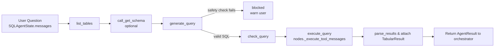

Bos-AI Multi-Agent Orchestration
================================

This document explains the current Bos-AI multi-agent architecture, the execution flow, and the components that make up the production implementation.

High-Level Request Flow
-----------------------

```mermaid
flowchart TB
    subgraph Client Layer
        A[Caller\n(API/UI/CLI)]
    end
    subgraph Orchestrator Runtime
        B[orchestrator.service.run / arun]
        C[LangGraph Orchestrator\n(workflow.compile_orchestrator)]
        D[Planner\nplanner.plan]
        E[Agent Execution Loop\nworkflow.execute_agent]
    F[Composer\ncomposer.compose]
    end
    subgraph Specialised Agents
        G[SQL Agent\nQueryAgent/sql_agent.py]
        H[Computation Agent\nComputationAgent/agent.py]
        I[API Docs Agent\nApiDocsAgent/agent.py]
    end
    subgraph Data Services
        I[Database / MCP Provider]
        J[Safe Python Sandbox]
    end

    A -->|AgentRequest| B
    B --> C
    C -->|PlannerDecision| D
    D -->|ordered agents| E
    E -->|invoke sql (auto-retries)| G
    E -->|invoke computation| H
    E -->|invoke api docs| I
    G -->|read-only SQL queries| I
    H -->|sandboxed code| J
    G -->|AgentResult| E
    H -->|AgentResult| E
    E -->|AgentResults| F
    F -->|OrchestratorResponse| B
    B -->|answer + trace| A
```

Component Breakdown
-------------------

- **Entry points (`Agents/orchestrator/service.py`, `server.py`, `main.py`)**
  - `run`/`arun` expose synchronous and asynchronous orchestrator execution with automatic graph compilation and logging setup.
  - `server.py` wires the orchestrator into the API surface (FastAPI/Starlette) for deployment.

- **Orchestrator workflow (`Agents/orchestrator/workflow.py`)**
  - Builds a `StateGraph` with `plan → execute_agent → compose`.
  - Persists `OrchestratorState`: request payload, planner decision, pending queue, accumulated `AgentResult` objects, and execution `TraceEvent`s.
  - Sequentially invokes agents chosen by the planner and records per-agent latency, output, and errors.

- **Planner (`Agents/orchestrator/planner.py`)**
  - Combines heuristic keyword matching with an LLM (`AzureChatOpenAI`) to rank eligible agents.
  - Produces a `PlannerDecision` containing rationale, agent ordering, confidence score, and applied guardrails.
  - Applies preference/disable lists from the incoming `AgentRequest`.

- **Composer (`Agents/orchestrator/composer.py`)**
  - Uses an LLM prompt to consolidate agent answers into the final `OrchestratorResponse`.
  - Selects a single `TabularResult` to return (first successful agent with tabular data).
  - Annotates metadata with planner confidence and agent participation.

- **SQL Agent (`Agents/QueryAgent`)**
  - Implemented as a LangGraph workflow (`sql_agent.compile_sql_agent`), exposing nodes defined in `nodes.py`.
  - Key stages: table overview, optional schema fetch, query generation, query checking, tool execution via MCP client, and result interpretation.
  - Automatically retries failed SQL executions (default 3 attempts). Each retry feeds the database error back into the LLM so follow-up queries can self-correct.
  - Enforces read-only usage through forbidden pattern checks and explicit allowed-table filters.
- **API Docs Agent (`Agents/ApiDocsAgent`)**
  - Loads curated context from `Docs/api_docs_context.yaml`, retrieves the most relevant snippets, and answers REST API questions with the shared Azure LLM.
  - Returns rich trace events referencing the documentation chunks used, enabling auditable responses.

- **Computation Agent (`Agents/ComputationAgent/agent.py`)**
  - Generates a computation plan and safe Python payload with LLM prompts and parses them into `_ComputationPlan`.
  - Executes code inside `SafeComputationSandbox`, capturing stdout, locals, and results; violations raise `SandboxViolation`.
  - Summarises outputs into `_ComputationSummary`, returning natural-language answers and optional structured tables.

- **Shared models and tracing (`Agents/core/models.py`)**
  - Defines `AgentRequest`, `AgentResult`, `TabularResult`, `TraceEvent`, and orchestration enums.
  - Centralises type coercion, error envelopes, and trace metadata (timestamps, event types).

SQL Agent Control Graph
-----------------------



Operational Considerations
--------------------------

- **Lifecycle & caching**
  - `_get_compiled_graph` caches the compiled LangGraph to avoid repeated graph builds per request.
  - Planner and agents lazily acquire shared resources through `Agents.QueryAgent.config.get_resources()`, centralising LLM credentials and MCP clients.

- **Tracing & observability**
  - Each agent appends `TraceEvent` entries describing decisions, tool invocations, and errors.
  - The orchestrator merges agent traces, enabling downstream monitoring or replay through `OrchestratorResponse.trace`.

- **Safety controls**
  - SQL agent: whitelist tables, block DDL/DML keywords, cross-check tool calls before execution.
  - Computation agent: sandbox restricts imports, system prompts forbid unsafe operations; violations surface as structured `AgentError`s.

- **Configuration knobs**
  - `AgentRequest` exposes `prefer_agents`, `disable_agents`, `context`, `max_turns`, and tracing flags.
  - `Agents/core/settings.py` (not shown) houses environment-driven settings such as LLM endpoints and sandbox timeouts.

Extensibility Guidelines
------------------------

1. **Adding a new specialist agent**
   - Implement an `AgentResult`-producing client with trace logging similar to the existing agents.
   - Register the agent in `Agents/core/models.AgentName` and update planner heuristics plus composer summaries.
   - Extend the orchestrator’s execution switch in `workflow.execute_agent`.

2. **Planner evolution**
   - Introduce capability metadata (e.g., required context keys, latency budgets) to drive smarter ordering.
   - Consider iterative planning: re-run the planner based on partial results when confidence < threshold.

3. **Observability & testing**
   - Capture token usage and tool metrics inside `TraceEvent.data` for SLO dashboards.
   - Build integration tests with mocked LLM responses to validate planner choices, SQL safety gates, and sandbox failure handling.

Reference: Multi-Agent Example
------------------------------

For comparison, `Examples/multi-agent-collaboration.ipynb` demonstrates a conversational multi-agent network using LangGraph. Our production flow adopts a planner-driven pipeline rather than round-robin dialogue, but the notebook is a useful reference for alternative coordination strategies and tooling patterns.


